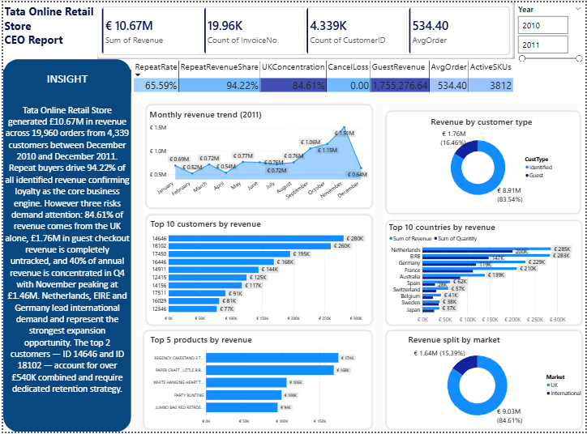

# 🛍️ Tata Online Retail – Power BI CEO Report

## 📸 Dashboard Preview

---

## 📌 Project Overview
This project was completed as part of the **Tata Group Data Visualisation Virtual Experience Program**.  
The objective was to analyse an online retail dataset and build an executive-level Power BI dashboard  
to support strategic decisions by the **CEO** and **CMO**.

The final report features KPI cards, a written narrative insight, trend analysis, customer and country  
revenue breakdowns, product performance, and market segmentation — all on a single interactive page.

---

## 🧹 Data Cleaning
Before analysis, the dataset was cleaned in Power Query using the following rules:
- ✅ Excluded records where **Quantity < 1** (returns removed)
- ✅ Excluded records where **Unit Price < $0** (data entry errors removed)

---

## 📊 Dashboard Highlights

### 🔢 KPI Summary Cards
| Metric | Value |
|--------|-------|
| Total Revenue | €10.67M |
| Total Invoices | 19.96K |
| Unique Customers | 4,339 |
| Average Order Value | €534.40 |

---

### 🧠 Executive Insight Panel
A written narrative summary was embedded directly into the dashboard, highlighting key findings:

- The store generated **€10.67M** across **19,960 orders** from **4,339 customers** between December 2010 and December 2011
- **Repeat buyers drive 94.22%** of all identified revenue — loyalty is the core business engine
- **84.61% of revenue** is concentrated in the UK, posing a diversification risk
- **€1.76M in guest revenue** is completely untracked — a key gap in customer data strategy
- **40% of annual revenue** is concentrated in Q4, with November peaking at **€1.46M**
- **Netherlands, EIRE, and Germany** lead international demand and represent the strongest expansion opportunities
- The **top 2 customers (ID 14646 & ID 18102)** account for over **€540K** and require dedicated retention strategy

---

### 📈 Question 1 – Monthly Revenue Trend (2011)
> **Requested by: CEO**

Time series chart showing monthly revenue for 2011. Revenue peaks in **November (€1.51M)**,  
revealing strong Q4 seasonality to guide inventory planning and next-year forecasting.

---

### 🌍 Question 2 – Top 10 Countries by Revenue (Excl. UK)
> **Requested by: CMO**

Horizontal bar chart of the top 10 international markets by revenue and quantity sold.  
**Netherlands, Eire, and Germany** are the strongest performers outside the UK.

---

### 👥 Question 3 – Top 10 Customers by Revenue
> **Requested by: CMO**

Descending bar chart of highest-value customers. Top customer generated **€280K**.  
Supports CMO's goal of targeting and retaining high-revenue accounts.

---

### 🗺️ Question 4 – Revenue Split by Market
> **Requested by: CEO**

Donut chart showing **UK (84.61%)** vs **International (15.39%)** revenue split,  
highlighting the scale of opportunity in global expansion.

---

### 🎁 Bonus Visuals
- **Revenue by Customer Type** — 83.54% from identified customers vs 16.46% guest revenue
- **Top 5 Products by Revenue** — Led by *Regency Cakestand 3T* (€174K) and *Paper Craft Little B* (€168K)

---

## 🛠️ Tools Used
- **Power BI Desktop** — DAX measures, data modelling, and dashboard design
- **Power Query** — Data cleaning and transformation

---

## 📁 Files in This Repository
| File | Description |
|------|-------------|
| `Tata project.pbix` | Power BI report with all visuals and data model |
| `Tata_Online_Retail_CEO_Report.pptx` | Stakeholder presentation deck |
| `dashboard_preview.png` | Screenshot of the final dashboard |

---

## 👤 Author
**Henry Olabode**  
[GitHub Profile](https://github.com/Henryolabode)
